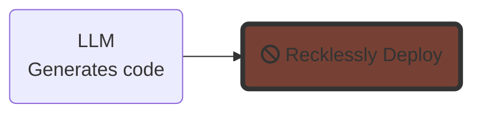
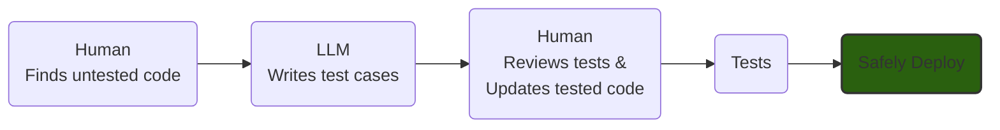

# The Mechanized Mending Manifesto

In software development, our greatest challenge is not our ability to produce new code, it’s in evolving the systems already in place.

Large Language Models (LLMs) can now generate code in certain contexts. However, their true potential extends beyond this: LLMs can revolutionize the way we maintain and improve code.

We seek to establish a harmony between human judgment, LLMs, and conventional algorithms,  each with their own strengths and weaknesses. For instance:

* Conventional algorithms are tireless and predictable. They are not good at being versatile or innovating.
* Humans are innovative and versatile. They are not good at being tireless or being predictable.
* LLMs are tireless and versatile. They are not good at being predictable or innovating.

The future of software maintenance hinges upon novel combinations of these elements. By harnessing the best aspects of each, we will foster a more efficient, reliable, and effective software ecosystem that advances the public good.

### Signatories
* [Ray Myers](https://www.linkedin.com/in/cadrlife)
* [Kristina Hager](https://www.linkedin.com/in/kristinahager)

### Thank you for reading!
Would you like sign the manifesto or provide feedback? Come see us [on GitHub](https://github.com/craftvscruft/mender.ai/issues/2).

---

## Appendix

### What NOT to do
Many people hear "AI can write code now" and picture a naive workflow such as this:

Not only is this unsafe due to the unpredictable nature of LLMs, it doesn't address the actual bottlenecks in software development. Developers can already type fast enough. We waste time on re-work, troubleshooting, and confusion to name a few.

* [IEEE 2015: I Know What You Did Last Summer - An Investigation of How Developers Spend Their Time](https://ieeexplore.ieee.org/document/7181430)
* [IEEE 2019: Today was a Good Day:
The Daily Life of Software Developers](https://www.microsoft.com/en-us/research/uploads/prod/2019/04/devtime-preprint-TSE19.pdf)
* [Forbes 2022: Measuring And Managing Technical Debt](https://www.forbes.com/sites/forbestechcouncil/2022/08/10/measuring-and-managing-technical-debt)
### Better Workflows
Optimizing for the maintenance of systems, this is one potential process that leverages the strength of each component for a flow that is both efficient and safe.

Or suppose we need to modify some untested legacy code. We might bring in the LLM as a pair programming partner to help us quickly backfill the tests.

Other viable setups will become apparent over time.

### Strengths

These are some of the relevant properties, not the only ones.

| Strength      | Humans      | Algorithms | LLMs        |
| ------------- | ----------- | -----------| ----------- |
| Innovation    | X           |            |             |
| Versatile     | X           |            | X           |
| Tireless      |             | X          | X           |
| Predictable   |             | X          |             |

### Glossary

**Conventional Algorithms**: In this context, we’re referring to any program that does not utilize deep-learning neural networks.

**Innovation**: The deliberate implementation of ideas resulting in new or improved products or methods. The ability to innovate implies being goal-directed and adaptive.

**Versatile**: Proficient in a broad range of tasks and able to respond gracefully to the unforeseen.

**Tireless**: Able to perform on demand at any time and in a highly scalable way.

**Predictable**: Able to deterministically respond exactly as expected for a known range of inputs.

**Goal-directed**: Having beliefs and desires, and trying to reach those desires by acting in accordance with those beliefs ([one](https://sites.google.com/site/minddict/intentional-stance-the) of many potential definitions).

**Adaptive**: Able to respond gracefully to new unknown events (see [Resilience 4](https://www.researchgate.net/publication/276139783_Four_concepts_for_resilience_and_the_implications_for_the_future_of_resilience_engineering)).

