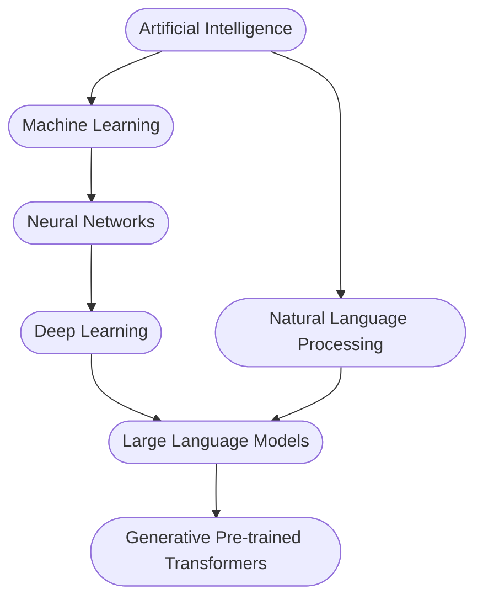
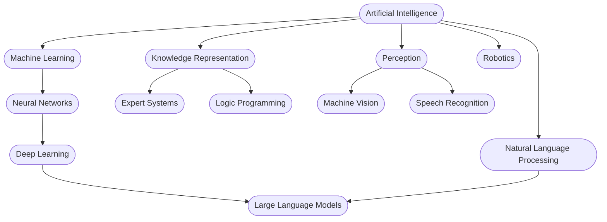

* [Learn Prompting](https://learnprompting.org/docs/intro) - Prompt Engineering tutorial
* [Dive into Deep Learning](https://www.d2l.ai) - Interactive deep learning book with code, math, and discussions. Implemented with PyTorch, NumPy/MXNet, JAX, and TensorFlow
* [Building LLM applications for production](https://huyenchip.com/2023/04/11/llm-engineering.html) - Article by Chip Huyen on common challenges 
* [Paradigms of Artificial Intelligence Programming: Case Studies in Common Lisp](https://github.com/norvig/paip-lisp) - 1992 book by Peter Norvig, code and PDF available. Beautiful survey of the history of AI techniques.
* [Stanford CS224N NLP with Deep Learning](https://www.youtube.com/watch?v=rmVRLeJRkl4&list=PLoROMvodv4rOSH4v6133s9LFPRHjEmbmJ&index=1) - Course videos

## What is AI?

What we consider AI is something of a moving target. We use AI to refer to the most advanced programs we know how to make. A program that can play checkers was once cutting-edge AI. Now we would think of it as a "simple" Minimax search algorithm. Recommendation systems were an AI problem, now we tend to just call them "Recommendation Engines". There may come a day when we understand LLMs well enough that they are "just LLMs", only associated with AI for historical reasons.

In the current news cycle, people are very excited about GPT - and with good reason. However, we should not consider GPT synonymous with AI. It is distinguished by being versatile, not by being the best we have for every task. This is roughly where GPT falls in the conceptual space.

Adding more sub-fields:

